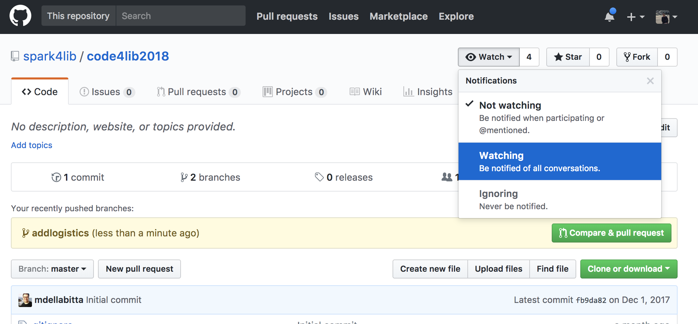

# Code4Lib 2018 Spark in the Dark 101 Workshop

Welcome to the open repository, documentation and materials for the Code4Lib 2018 Spark in the Dark 101 Workshop!

* When: Tuesday, February 13th, 2018, 9:00 AM - 12:00 PM
* Where: [Omni Shoreham Hotel Senate Room, Main Conference Venue](http://2018.code4lib.org/general-info/venues/)
* Workshop Materials: [github.com/spark4lib/code4lib2018](https://github.com/spark4lib/code4lib2018)
* Workshop Slides: [bit.ly/C4L18SparkSlides](http://bit.ly/C4L18SparkSlides) or [in this Repository](slides/SparkInTheDark101.pdf)

## About the Workshop

This is an introductory session on [Apache Spark](https://spark.apache.org/), a framework for large-scale data processing. We will introduce high level concepts around Spark, including how Spark execution works and it’s relationship to the other technologies for working with Big Data. Following this introduction to the theory and background, we will walk workshop participants through hands-on usage of spark-shell, Zeppelin notebooks, and Spark SQL for processing library data. The workshop will wrap up with use cases and demos for leveraging Spark within cultural heritage institutions and information organizations, connecting the building blocks learned to current projects in the real world.

This workshop is a registration-only workshop as part of [Code4Lib 2018 in Washington, D.C.](http://2018.code4lib.org/). For registration information or other conference-level logistical questions, please check the [Code4Lib 2018 Registration page](http://2018.code4lib.org/general-info/attend). If you have questions about the workshop specifically, you can [contact the workshop leaders using the information below](#contact-before-during-after-the-workshop).

We ask that all participants come to the workshop ready to dive in by reviewing the information in this document. If you want a sneak peak of the workshop's contents, feel free to also watch this repository (you'll be notified of updates). To watch this repository, sign into GitHub, go this repository's home URL, and click the following button:

## Workshop Schedule

Time               | Topic                                                          | Leader(s)
------------------ | -------------------------------------------------------------- | ------------------------------------------
**9-9:10 AM**      | Workshop Introduction, Logistics, Goals (10 minutes)           | [Christina](mailto:cmharlow@stanford.edu)
**9:10-9:25 AM**   | Spark Theory: Optimal use cases for Spark (15 minutes)         | [Audrey](mailto:audrey@dp.la)
**9:25-9:40 AM**   | Spark Theory: Spark Architecture (sparkitecture?) (15 minutes) | [Michael](mailto:michael@dp.la)
**9:40-9:55 AM**   | Spark Theory: RDD vs. DataFrame APIs (15 minutes)              | [Scott](mailto:scott@dp.la)
**9:55-10:15 AM**  | Spark Practice: Env/setup (20 minutes)                         | [Mark](mailto:mb@dp.la) & [Justin](mailto:jcoyne@stanford.edu)
**10:15-10:30 AM** | break (15 minutes)                                             | n/a
**10:30-10:50 AM** | Spark Practice: Working with spark-shell (20 minutes)          | [Christina](mailto:cmharlow@stanford.edu) & [Audrey](mailto:audrey@dp.la)
**10:50-11:10 AM** | Spark Practice: Working with zeppelin (20 minutes)             | [Christina](mailto:cmharlow@stanford.edu) & [Audrey](mailto:audrey@dp.la)
**11:10-11:45 AM** | Spark Practice: Interacting with Real World Data (20 minutes)  | Whole Group
**11:45-Noon**     | Examples & Wrap-Up (30 minutes)                                | Whole Group

## Contact Before, During, After the Workshop

If you have questions or concerns leading up to or after the workshop, please open an issue on this GitHub repository, particularly with any questions dealing with workshop preparation or any installation issues. This allows multiple workshop leaders to respond as able, and other participants can also learn (since we're sure the same questions will come up multiple times): https://github.com/spark4lib/code4lib2018/issues (this will require that you login or create a free account with GitHub).

During the workshop, we will indicate the best ways to get help or communicate a question/comment - however, this workshop is intended to be informal, so feel free to speak up or indicate you have a question at any time.

## Our Expectations of You

To keep this workshop a safe and inclusive space, we ask that you review and follow the [Code4Lib 2018 Code of Conduct](http://2018.code4lib.org/conduct/) and [the Recurse Center Social Rules (aka Hacker School Rules)](https://www.recurse.com/manual#sub-sec-social-rules).

## Participant Requirements

We request that all participants:
 - You should also fill out [this pre-workshop survey](https://goo.gl/forms/Ps9KhjnsauMbGdpv2) by **February 9th** in order to help the facilitators best plan.
- You should bring a laptop with a modern web browser and at least 4Gb memory (at we strongly recommend, if you want to play with more than intro data, at least 6Gb);
- On that laptop, please already have installed the latest, stable version of [Docker Community Edition](https://www.docker.com/community-edition) installed;
- Also on that laptop, please have bookmarked or have pulled down the latest version of this GitHub repository.

We will be sending out an email with the specific Docker image information before Monday.

If you have any issues with the above, please contact us ASAP using the [communication methods detailed above](#contact-before-during-after-the-workshop).

### Running the Docker Container
1. You need this GitHub repository locally. Clone it (and run `git pull origin master`) or download it, and make sure you have the latest copy.
2. Change into the top level directory of this Git repository.
3. With the latest, stable version of Docker Community Edition installed, go to your favorite shell and run: `docker pull mbdpla/sparkworkshop:latest`
4. In that same top level directory of this Git repository, now run: `docker run -p 8080:8080 -v $PWD:/code4lib2018 -e ZEPPELIN_NOTEBOOK_DIR='/code4lib2018/notebooks' mbdpla/sparkworkshop:latest`

This should download and start up our Zeppelin Docker image on your machine. Check if it is running by opening and web browser and going to http://localhost:8080. This should show Zeppelin Notebook homepage with 2 notebooks loaded. **It will save Notebooks directly to your GitHub repository directory, so be aware of that!**

We recommend re-pulling both this repository & the docker image Monday evening, if possible, to make sure you get the latest representation of the work.

The day of, we will also bring thumbdrives with our workshop Docker image on it.

### Backup Option

- If wifi works, try a [free Databricks Community account online](https://databricks.com/try-databricks). This gives you a hosted Zeppelin notebook with Spark infrastructure, for free.
- If you’re feeling up to it, [get Zeppelin installed locally on your computer](https://zeppelin.apache.org/docs/0.7.3/install/install.html). Zeppelin comes with Spark.

Either way, you’ll need to pull the [data](sample-data/) & [notebooks](notebooks/) from this Github repository.
