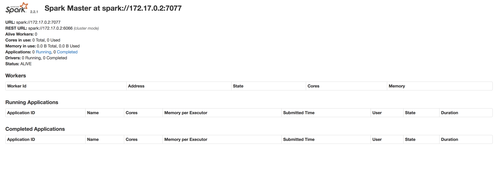

# Spark Practice: Working with `spark-shell` Steps

The presenter is running this with a local, standalone installation of Spark 2.2.1. If you want to try this but don't have Spark installed, see the docker options for getting a container with Spark shell via PySpark available at [the bottom of this workshop](#run-the-spark---shell-walk---through-yourself). Slides (captured mainly as a back-up in case of computer issues: https://docs.google.com/presentation/d/1W3xGitwB_nM36kTvVRsAQjRtw763HI7S00-an0nhhSI/edit#slide=id.g2e2dc1ae6b_0_9)

## Run a PySpark Interpreter Shell

```shell
$ pyspark
```

You should see something like the following:

```
$ pyspark
Python 3.5.1 (default, May 24 2017, 21:07:43)
[GCC 4.2.1 Compatible Apple LLVM 8.1.0 (clang-802.0.42)] on darwin
Type "help", "copyright", "credits" or "license" for more information.
Using Spark's default log4j profile: org/apache/spark/log4j-defaults.properties
Setting default log level to "WARN".
To adjust logging level use sc.setLogLevel(newLevel). For SparkR, use setLogLevel(newLevel).
18/02/11 10:50:02 WARN NativeCodeLoader: Unable to load native-hadoop library for your platform... using builtin-java classes where applicable
18/02/11 10:50:07 WARN ObjectStore: Failed to get database global_temp, returning NoSuchObjectException
Welcome to
      ____              __
     / __/__  ___ _____/ /__
    _\ \/ _ \/ _ `/ __/  '_/
   /__ / .__/\_,_/_/ /_/\_\   version 2.2.1
      /_/

Using Python version 3.5.1 (default, May 24 2017 21:07:43)
SparkSession available as 'spark'.
>>>
```

Notes:
- We are running in the PySpark interpreter to see spark-shell. Once could also run a Scala interpreter.
- This automatically makes a SparkSession for us; when coding, you'll need to start this yourself.

## Check out the Spark Standalone Dashboard

If you're running on the setup instructions below (i.e. you're running your docker container on port 3030), at https://localhost:3030 should be your Spark Dashboard.

.

## Our Dataset for this Simple Walk through:

See [the CSV file here](../sample-data/small-sample.csv).

| Name | Institution Type | Format | URL | Description |
| ---- | ---------------- | ------ | --- | ----------- |
| CMOA | Museum | JSON, CSV | https://github.com/cmoa/collection |
| Penn Museum | Museum | JSON, CSV, XML | https://www.penn.museum/collections/data.php | JSON is poorly structured |
| Met Museum | Museum | CSV |  | ¯\_(ツ)_/¯\n |
| DigitalNZ Te Puna Web Directory | Library | XML | https://natlib.govt.nz/files/data/tepunawebdirectory.xml,MARC | XML |
| Canadian Subject Headings | Library | RDF/XML | http://www.collectionscanada.gc.ca/obj/900/f11/040004/csh.rdf | "Ugh, rdf" |
| DPLA | Aggregator | CSV,JSON,XML | dp.la |

## Read a CSV File

Read the CSV using the PySpark read & CSV libraries in our interpreter shell:

```
> spark.read.csv("sample-data/small-sample.csv")
DataFrame[_c0: string, _c1: string, _c2: string, _c3: string, _c4: string, _c5: string]
```

We see it makes a dataframe. But what if we want to see the data? Run `.show()` on that data to see what was read in?

```
> spark.read.csv("sample-data/small-sample.csv").show()
+--------------------+----------------+--------------+--------------------+--------------------+--------------+
|                 _c0|             _c1|           _c2|                 _c3|                 _c4|           _c5|
+--------------------+----------------+--------------+--------------------+--------------------+--------------+
|                Name|Institution Type|        Format|                 URL|         Description|Informal Score|
|                CMOA|          Museum|     JSON, CSV|https://github.co...|                null|            10|
|         Penn Museum|          Museum|JSON, CSV, XML|https://www.penn....|JSON is poorly st...|             7|
|          Met Museum|          Museum|           CSV|                null|            ¯_(ツ)_/¯|          null|
|                  ,3|            null|          null|                null|                null|          null|
|DigitalNZ Te Puna...|         Library|           XML|https://natlib.go...|            MARC XML|             3|
|Canadian Subject ...|         Library|       RDF/XML|http://www.collec...|            Ugh, rdf|             4|
|                DPLA|     Aggregator |  CSV,JSON,XML|               dp.la|                null|           100|
+--------------------+----------------+--------------+--------------------+--------------------+--------------+
```

Great! But... not entirely. What about headers?


```
> spark.read.csv("sample-data/small-sample.csv", header=True).show()
+--------------------+----------------+--------------+--------------------+--------------------+--------------+
|                Name|Institution Type|        Format|                 URL|         Description|Informal Score|
+--------------------+----------------+--------------+--------------------+--------------------+--------------+
|                CMOA|          Museum|     JSON, CSV|https://github.co...|                null|            10|
|         Penn Museum|          Museum|JSON, CSV, XML|https://www.penn....|JSON is poorly st...|             7|
|          Met Museum|          Museum|           CSV|                null|            ¯_(ツ)_/¯|          null|
|                  ,3|            null|          null|                null|                null|          null|
|DigitalNZ Te Puna...|         Library|           XML|https://natlib.go...|            MARC XML|             3|
|Canadian Subject ...|         Library|       RDF/XML|http://www.collec...|            Ugh, rdf|             4|
|                DPLA|     Aggregator |  CSV,JSON,XML|               dp.la|                null|           100|
+--------------------+----------------+--------------+--------------------+--------------------+--------------+
```

That's better.

But hold up, we seem to have trouble with a pesky newline in one of the cells. Let's try `DROPMALFORMED` mode and see if that helps.

```
> spark.read.csv("sample-data/small-sample.csv", header=True, mode="DROPMALFORMED").show()
+--------------------+----------------+--------------+--------------------+--------------------+--------------+
|                Name|Institution Type|        Format|                 URL|         Description|Informal Score|
+--------------------+----------------+--------------+--------------------+--------------------+--------------+
|                CMOA|          Museum|     JSON, CSV|https://github.co...|                null|            10|
|         Penn Museum|          Museum|JSON, CSV, XML|https://www.penn....|JSON is poorly st...|             7|
|DigitalNZ Te Puna...|         Library|           XML|https://natlib.go...|            MARC XML|             3|
|Canadian Subject ...|         Library|       RDF/XML|http://www.collec...|            Ugh, rdf|             4|
|                DPLA|     Aggregator |  CSV,JSON,XML|               dp.la|                null|           100|
+--------------------+----------------+--------------+--------------------+--------------------+--------------+
```

Well, that's better, but we don't want to lose the Met's row. Let's try the `multiLine` option instead (this option is available in Spark 2.2.x ONLY).

```
> spark.read.csv("sample-data/small-sample.csv", header=True, multiLine=True).show()
+--------------------+----------------+--------------+--------------------+--------------------+---------------+
|                Name|Institution Type|        Format|                 URL|         Description|Informal Score
+--------------------+----------------+--------------+--------------------+--------------------+---------------+
|                CMOA|          Museum|     JSON, CSV|https://github.co...|                null|            10
|         Penn Museum|          Museum|JSON, CSV, XML|https://www.penn....|JSON is poorly st...|             7
|          Met Museum|          Museum|           CSV|                null|          ¯_(ツ)_/¯
|             3
|DigitalNZ Te Puna...|         Library|           XML|https://natlib.go...|            MARC XML|             3
|Canadian Subject ...|         Library|       RDF/XML|http://www.collec...|            Ugh, rdf|             4
|                DPLA|     Aggregator |  CSV,JSON,XML|               dp.la|                null|           100
+--------------------+----------------+--------------+--------------------+--------------------+---------------+
```

That's... better? That column still looks wonky, but that may just be `show()` awkward presentation. Let's inspect the inferred schema of this DataFrame:

```
> spark.read.csv("sample-data/small-sample.csv", header=True, multiLine=True).printSchema()
root
 |-- Name: string (nullable = true)
 |-- Institution Type: string (nullable = true)
 |-- Format: string (nullable = true)
 |-- URL: string (nullable = true)
 |-- Description: string (nullable = true)
 |-- Informal Score: string (nullable = true)
```

Looks good. But let's go ahead and pass in a specified schema. First we need to create one with the specific datatypes declared:

```
> from pyspark.sql.types import *
> customSchema = StructType([
    StructField("Name", StringType(), True),
    StructField("Institution Type", StringType(), True),
    StructField("Format", StringType(), True),
    StructField("URL", StringType(), True),
    StructField("Description", StringType(), True),
    StructField("Informal Score", DecimalType(), True)])
> sampleDf = spark.read.csv("sample-data/small-sample.csv", header=True, multiLine=True, schema=customSchema)
> sampleDf.show()
+--------------------+----------------+--------------+--------------------+--------------------+--------------+
|                Name|Institution Type|        Format|                 URL|         Description|Informal Score|
+--------------------+----------------+--------------+--------------------+--------------------+--------------+
|                CMOA|          Museum|     JSON, CSV|https://github.co...|                  10|          null|
|         Penn Museum|          Museum|JSON, CSV, XML|https://www.penn....|JSON is poorly st...|             7|
|          Met Museum|          Museum|           CSV|                null|           ¯_(ツ)_/¯
|             3|
|DigitalNZ Te Puna...|         Library|           XML|https://natlib.go...|            MARC XML|             3|
|Canadian Subject ...|         Library|       RDF/XML|http://www.collec...|            Ugh, rdf|             4|
|                DPLA|      Aggregator|  CSV,JSON,XML|               dp.la|                 100|          null|
+--------------------+----------------+--------------+--------------------+--------------------+--------------+
```

# Simple Data Analysis

Our CSV has been read into a Dataframe pretty well, and is now stored at `sampleDf`. We're still a bit worried about that line, let's check the number of rows:

```sh
> sampleDf.count()
6
```
Now, do we have the correct number of non-header rows? 6? Yep. Now let's inspect some of the rows (just a provided number, akin to `head` in Bash):

```sh
> sampleDf.head(4)
[Row(Name='CMOA', Institution Type='Museum', Format='JSON, CSV', URL='https://github.com/cmoa/collection', Description='10', Informal Score=None), Row(Name='Penn Museum', Institution Type='Museum', Format='JSON, CSV, XML', URL='https://www.penn.museum/collections/data.php', Description='JSON is poorly structured', Informal Score=Decimal('7')), Row(Name='Met Museum', Institution Type='Museum', Format='CSV', URL=None, Description='¯_(ツ)_/¯\n', Informal Score=Decimal('3')), Row(Name='DigitalNZ Te Puna Web Directory', Institution Type='Library', Format='XML', URL='https://natlib.govt.nz/files/data/tepunawebdirectory.xml', Description='MARC XML', Informal Score=Decimal('3'))]
```

This returns an Array of Spark Rows, so that looks good. Let's check the number of columns:

```sh
> sampleDf.columns
['Name', 'Institution Type', 'Format', 'URL', 'Description', 'Informal Score', 'CSV', 'XML', 'RDF', 'JSON']
> len(sampleDf.columns)
10
```

Then inspect specific columns now using `select(colName)`:

```sh
> sampleDf.select("Name").show()
+--------------------+
|                Name|
+--------------------+
|                CMOA|
|         Penn Museum|
|          Met Museum|
|DigitalNZ Te Puna...|
|Canadian Subject ...|
|                DPLA|
+--------------------+
```

Looks good! And the `Informal Score` column?

```sh
> sampleDf.select("Name", "Informal Score").show()
+--------------------+--------------+
|                Name|Informal Score|
+--------------------+--------------+
|                CMOA|          null|
|         Penn Museum|             7|
|          Met Museum|             3|
|DigitalNZ Te Puna...|             3|
|Canadian Subject ...|             4|
|                DPLA|          null|
+--------------------+--------------+
```

Now we feel comfortable with the data loaded, we can do some more analysis. Let's apply a `.filter()` based on the `Informal Score` and compare it with `select()`:

```sh
> scoresBooleanDf = sampleDf.select('Name', 'URL', sampleDf['Informal Score'] > 5)
> scoresBooleanDf.show()
+--------------------+--------------------+--------------------+
|                Name|                 URL|(Informal Score > 5)|
+--------------------+--------------------+--------------------+
|                CMOA|https://github.co...|                null|
|         Penn Museum|https://www.penn....|                true|
|          Met Museum|                null|               false|
|DigitalNZ Te Puna...|https://natlib.go...|               false|
|Canadian Subject ...|http://www.collec...|               false|
|                DPLA|               dp.la|                null|
+--------------------+--------------------+--------------------+
> highScoresDf = sampleDf.filter(sampleDf['Informal Score'] > 5)
> highScoresDf.select('Name', 'URL', 'Informal Score').show()
+-----------+--------------------+--------------+
|       Name|                 URL|Informal Score|
+-----------+--------------------+--------------+
|Penn Museum|https://www.penn....|             7|
+-----------+--------------------+--------------+
```

One gives us a True / False if the provided condition is met, and the other only returns rows when the condition is met (i.e. is `True`).

And then to order results from these methods:

```sh
> sampleDf.orderBy("Informal Score").show()
+--------------------+----------------+--------------+--------------------+--------------------+--------------+
|                Name|Institution Type|        Format|                 URL|         Description|Informal Score|
+--------------------+----------------+--------------+--------------------+--------------------+--------------+
|                DPLA|      Aggregator|  CSV,JSON,XML|               dp.la|                 100|          null|
|                CMOA|          Museum|     JSON, CSV|https://github.co...|                  10|          null|
|          Met Museum|          Museum|           CSV|                null|           ¯_(ツ)_/¯
|             3|
|DigitalNZ Te Puna...|         Library|           XML|https://natlib.go...|            MARC XML|             3|
|Canadian Subject ...|         Library|       RDF/XML|http://www.collec...|            Ugh, rdf|             4|
|         Penn Museum|          Museum|JSON, CSV, XML|https://www.penn....|JSON is poorly st...|             7|
+--------------------+----------------+--------------+--------------------+--------------------+--------------+

> sampleDf.orderBy(sampleDf["Informal Score"].desc()).show()
+--------------------+----------------+--------------+--------------------+--------------------+--------------+
|                Name|Institution Type|        Format|                 URL|         Description|Informal Score|
+--------------------+----------------+--------------+--------------------+--------------------+--------------+
|         Penn Museum|          Museum|JSON, CSV, XML|https://www.penn....|JSON is poorly st...|             7|
|Canadian Subject ...|         Library|       RDF/XML|http://www.collec...|            Ugh, rdf|             4|
|          Met Museum|          Museum|           CSV|                null|           ¯_(ツ)_/¯
|             3|
|DigitalNZ Te Puna...|         Library|           XML|https://natlib.go...|            MARC XML|             3|
|                CMOA|          Museum|     JSON, CSV|https://github.co...|                  10|          null|
|                DPLA|      Aggregator|  CSV,JSON,XML|               dp.la|                 100|          null|
+--------------------+----------------+--------------+--------------------+--------------------+--------------+
```

Note that ordering defaults to Ascending, and you need to add `.desc()` for descending order.

Another helpful, quick analysis function is Grouping.

```sh
> URLGroupDf = sampleDf.groupBy("Format").count()
> URLGroupDf.show()
+--------------+-----+
|        Format|count|
+--------------+-----+
|           CSV|    1|
|           XML|    1|
|     JSON, CSV|    1|
|JSON, CSV, XML|    1|
|       RDF/XML|    1|
|  CSV,JSON,XML|    1|
+--------------+-----+

> URLGroupDf.printSchema()
root
 |-- Format: string (nullable = true)
 |-- count: long (nullable = false)
```

And there is the ability to ask for `distinct()` values only:

```sh
> sampleDf.select("Format").distinct().show()
+--------------+
|        Format|
+--------------+
|           CSV|
|           XML|
|     JSON, CSV|
|JSON, CSV, XML|
|       RDF/XML|
|  CSV,JSON,XML|
+--------------+
> sampleDf.select("Format").distinct().count()
6
```

This leads us to another problem we need to address here: multi-value cells.

## Simple Changes to our DataFrame

The `explode` function allows us to split multi-value cells across rows, with the rest of the row's data staying the same:

```sh
> from pyspark.sql.functions import *
> sampleDf = sampleDf.withColumn("Format", explode(split("Format", ",")))
> sampleDf.show()
+--------------------+----------------+-------+--------------------+--------------------+--------------+
|                Name|Institution Type| Format|                 URL|         Description|Informal Score|
+--------------------+----------------+-------+--------------------+--------------------+--------------+
|                CMOA|          Museum|   JSON|https://github.co...|                  10|          null|
|                CMOA|          Museum|    CSV|https://github.co...|                  10|          null|
|         Penn Museum|          Museum|   JSON|https://www.penn....|JSON is poorly st...|             7|
|         Penn Museum|          Museum|    CSV|https://www.penn....|JSON is poorly st...|             7|
|         Penn Museum|          Museum|    XML|https://www.penn....|JSON is poorly st...|             7|
|          Met Museum|          Museum|    CSV|                null|           ¯_(ツ)_/¯
|             3|
|DigitalNZ Te Puna...|         Library|    XML|https://natlib.go...|            MARC XML|             3|
|Canadian Subject ...|         Library|RDF/XML|http://www.collec...|            Ugh, rdf|             4|
|                DPLA|      Aggregator|    CSV|               dp.la|                 100|          null|
|                DPLA|      Aggregator|   JSON|               dp.la|                 100|          null|
|                DPLA|      Aggregator|    XML|               dp.la|                 100|          null|
+--------------------+----------------+-------+--------------------+--------------------+--------------+
```

Alternatively, depending on what you want to do, you can create new columns based on analysis of that multivalue field:

```sh
> sampleDf = sampleDf.withColumn('CSV', sampleDf.Format.like("%CSV%"))
> sampleDf = sampleDf.withColumn('XML', sampleDf.Format.like("%XML%"))
> sampleDf = sampleDf.withColumn('RDF', sampleDf.Format.like("%RDF%"))
> sampleDf = sampleDf.withColumn('JSON', sampleDf.Format.like("%JSON%"))
> sampleDf.show()
+--------------------+----------------+-------+--------------------+--------------------+--------------+-----+-----+-----+-----+
|                Name|Institution Type| Format|                 URL|         Description|Informal Score|  CSV|  XML|  RDF| JSON|
+--------------------+----------------+-------+--------------------+--------------------+--------------+-----+-----+-----+-----+
|                CMOA|          Museum|   JSON|https://github.co...|                  10|          null|false|false|false| true|
|                CMOA|          Museum|    CSV|https://github.co...|                  10|          null| true|false|false|false|
|         Penn Museum|          Museum|   JSON|https://www.penn....|JSON is poorly st...|             7|false|false|false| true|
|         Penn Museum|          Museum|    CSV|https://www.penn....|JSON is poorly st...|             7| true|false|false|false|
|         Penn Museum|          Museum|    XML|https://www.penn....|JSON is poorly st...|             7|false| true|false|false|
|          Met Museum|          Museum|    CSV|                null|           ¯_(ツ)_/¯
|             3| true|false|false|false|
|DigitalNZ Te Puna...|         Library|    XML|https://natlib.go...|            MARC XML|             3|false| true|false|false|
|Canadian Subject ...|         Library|RDF/XML|http://www.collec...|            Ugh, rdf|             4|false| true| true|false|
|                DPLA|      Aggregator|    CSV|               dp.la|                 100|          null| true|false|false|false|
|                DPLA|      Aggregator|   JSON|               dp.la|                 100|          null|false|false|false| true|
|                DPLA|      Aggregator|    XML|               dp.la|                 100|          null|false| true|false|false|
+--------------------+----------------+-------+--------------------+--------------------+--------------+-----+-----+-----+-----+
```

With these simple, connected functions, we should have what we need to handle checking unique `Format` values (note: there are a million other ways to handle this as well!):

```sh
> sampleDf.select("Format").distinct().show()
+-------+
| Format|
+-------+
|    CSV|
|    XML|
|    CSV|
|    XML|
|RDF/XML|
|   JSON|
+-------+
```

Hold on- why is this not fixed yet? Because of something common to data mungers: whitespace. Let's remove that white space using regex replacement:

```sh
> sampleDf = sampleDf.withColumn("Format", regexp_replace(sampleDf.Format, "\s+", ""))
> sampleDf.select("Format").distinct().show()
+-------+
| Format|
+-------+
|    CSV|
|    XML|
|RDF/XML|
|   JSON|
+-------+
```

This should repair our `Format` column. Let's now run a function to get a subset of rows based on a `where` conditional:

```sh
> sampleDf.where(col('Format') == 'XML').show()
+--------------------+----------------+------+--------------------+--------------------+--------------+-----+----+-----+-----+
|                Name|Institution Type|Format|                 URL|         Description|Informal Score|  CSV| XML|  RDF| JSON|
+--------------------+----------------+------+--------------------+--------------------+--------------+-----+----+-----+-----+
|         Penn Museum|          Museum|   XML|https://www.penn....|JSON is poorly st...|             7|false|true|false|false|
|DigitalNZ Te Puna...|         Library|   XML|https://natlib.go...|            MARC XML|             3|false|true|false|false|
|                DPLA|      Aggregator|   XML|               dp.la|                 100|          null|false|true|false|false|
+--------------------+----------------+------+--------------------+--------------------+--------------+-----+----+-----+-----+

> sampleDf.where(col('Format') == 'XML').count()
3
```

## Running SQL Queries

We can also use Spark SQL to run SQL queries on our Dataframe. We need to first create a view (ours will be temporary; consider this an in-memory table); then write our SQL query and `collect()` the results:

```py
> sampleDf.createOrReplaceTempView("sampleDataView")
>>> query = spark.sql("""SELECT `Institution Type`, COUNT(DISTINCT(Format)) as NumFormats
...                      FROM sampleDataView
...                      GROUP BY `Institution Type`""")
>>> query.collect()
[Row(Institution Type='Library', NumFormats=2), Row(Institution Type='Aggregator', NumFormats=3), Row(Institution Type='Museum', NumFormats=3)]
>>> for n in query.collect():
...     n
...
Row(Institution Type='Library', NumFormats=2)
Row(Institution Type='Aggregator', NumFormats=3)
Row(Institution Type='Museum', NumFormats=3)
```

Note this returns an array of PySpark Rows.

At this point, we're going to move to the [Zeppelin Notebook portion of this workshop](working-with-zeppelin.md), where you'll be running these commands (and more) yourself.

# Run the Spark-Shell Walk-through Yourself

1. I am using the Getty Images docker container for this section (Thanks, Getty!) for sake of consistency:
    ```bash
    $ docker pull gettyimages/spark
    ```
2. Start docker:
    ```bash
    $ docker run --name start-shell -p 3030:8080 gettyimages/spark
    ```
3. SSH into the Docker bash shell: :
    ```bash
    $ docker exec -it start-shell /bin/bash
    ```
4. Grab our small sample data and check out that it transferred okay
    ```bash
    $ mkdir sample-data
    $ curl https://raw.githubusercontent.com/spark4lib/code4lib2018/master/sample-data/small-sample.csv > sample-data/small-sample.csv
    $ head sample-data/small-sample.csv
    ```
5. Start pyspark
   ```bash
   $ pyspark
   ```
6. Run the steps above yourself!
